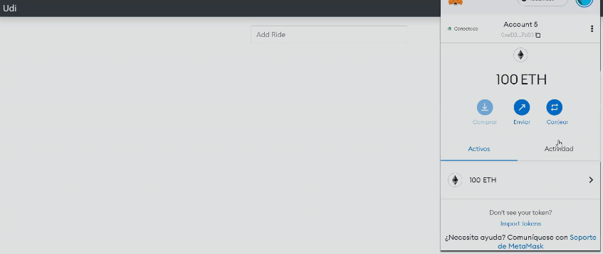
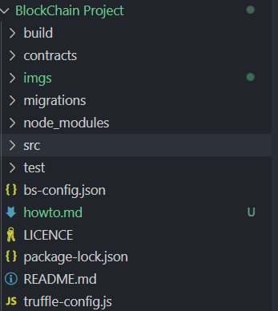

<h1 align="center">
How to Carpooling Application with Blockchain 
 </h1>

<h3 align="center"> Team Ara Ara</h3>
<h3 align="center"> Cryptology and Security Tools February - June 2022</h3>

In this file, we will explain the system functionality for the Carpooling Project. 

<h2> Application Preview</h2>

The application allows the user to
<ul>
    <li> See all the available rides(Rides that have not been checked out)</li>
    <li> Add a ride (Add a new ride so that other users can see it)</li>
    <li> Check out a ride by using smart contracts</li>
</ul>

<h2> Project Structure </h2>

Once the dependencies mentioned on READ ME [Read me file](https://github.com/gisgiselle/Cryptology/tree/main/BlockChain%20Project#readme) file are installed
<ul>
    <ul>
        <li>truffle migrate reset</li>
        <li>npm run dev</li>
    </ul>
    <li> See all the available rides(Rides that have not been checked out)</li>
    <li> Add a ride (Add a new ride so that other users can see it)</li>
    <li> Check out a ride by using smart contracts</li>
</ul>

